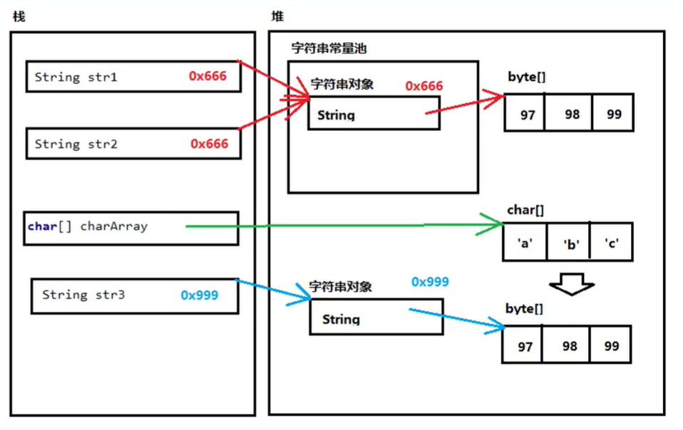

# Day02-Java

略过部分基础知识，直接快进到不同点

## Java的数据类型

基本类型 包装类（引用类型，包装类都位于java.lang包下）

byte Byte

short Short

int Integer 【特殊】

long Long

float Float

double Double

char Character 【特殊】

boolean Boolean

## ArrayList类

数组的长度不能发生改变

ArrayList集合的长度是可以改变的

### ArrayList&lt;E&gt;

对于ArrayList来说，&lt;E&gt;代表泛型。

泛型：装在集合当中的所有元素，只能**统一为泛型的类型**,而且不能为基本类型，只能为引用类型.

ArrayList集合虽然是一个类，但是在直接打印ArrayList时不会显示地址，而是显示相应的内容

### ArrayList常用方法

_public boolean add\(E e\);_ 向集合中添加元素，要求添加的参数类型与泛型一致

_public E get\(int index\);_从集合中提取，参数是索引标号，返回值为对应的元素

_public E remove int index\);_从集合中删除参数，返回值为被删除的元素

_public int size\(\)_ 获取集合的长度，返回值为长度大小

## String

在Java中，所有字符串字面量都是String类的实例实现，即所有双引号字符都是String类的对象

特点：

* 字符串的内容永不改变，即为常量
* 字符串是可以共享使用的
* 字符串效果上相当于char\[\]型字符数组，底层原理是byte\[\]字节数组

有三种构造方法：建立空字符串、根据字数数组创建字符串、根据字节数组创建字符串，还可以直接创建

```java
byte[] byteArray={97,98,99};
char[] charArray=['a','b','c'];
String str1= new String();
String str2= new String(charArray);
String str3= new String(byteArray);
String str4= "Hello";
```

### 字符串常量池

在java中，字符串常量池存在内存的堆里。

在程序中，所有用双引号创建的字符串都会存入字符串常量池当中，会创建一个字符串对象，同时还会创建一个byte字节数组，用于存储字符串真正的值。

```java
String str1="abc";
/*
使用双引号创建str1，会在堆的字符串常量池中创建一个字符串对象，同时在常量池外还会创建一个byte字节数组
栈中的str1存储的是字符串常量池的字符串对象A的地址，字符串对象A存储的是byte字节数组的地址，字节数组存取的是字符串真正的内容
*/
String str2="abc";
/*
使用双引号创建str1，但是由于已经存在相同数据的对象，因此返回给str2的值也是常量池中字符串对象A的地址
*/
char[] charArray={'a','b','c'};
String str3= new String(charArray);
/*
先创建charArray，创建一个字符数组存储在堆中，然后用new String的方式创建一个字符串对象
此时在堆中会创建一个byte字节数组，内容为charArray字符数组的值，str3的存储的值实际上为byte字节数组的地址
*/
```



### String类常用的方法

String有很多的方法，下面列举一些比较常用的：

* 判断字符串内容是否相等：**public boolean equals\(Object obj\)**，参数可以是任何对象
  * equals具有对称性，a.equals\(b\)==b.equals\(a\)
  * 如果比较双方，一个是常量另一个是变量，推荐把常量字符写在前面

    ```java
    String str1 = null;
    System.out.print("abc".equals(str1));//推荐
    System.out.print(str1.equals("abc"));//不推荐，会产生空指针异常NullPointerException
    ```

  * equalsIgnoreCase\(Object obj\)该方法可以忽略字母的大小写
* 判断字符串含有的字符个数，返回长度：**public int Length\(\);**
* 拼接两个不同的字符串，返回新的字符串：**public String concat\(String str\);**
* 获取指定索引位置的字符串：**public char charAt\(int index\);**
* 查找参数字符串在本字符串中首次出现的**索引**，如果没有则返回-1：**public int indexOf\(String str\);**
* 截取字符串：
  * 从参数为止到字符串末尾：substring\(int index\);
  * 从begin开始到end：substring\(int begin,int end\);//\[begin,end\)
* 将当前字符串拆分成字符数组作为返回值：**public char\[\] toCharArray\(\);**
* 获得当前字符串的底层字节数组：**public byte\[\] getBytes\(\);**
* 将所有出现的_旧字符串_替换成_新字符串_，返回替换之后的新字符串：**public replace\(CharSequence oldString, CharSequence newString\);**
* 根据参数的规则分割字符串：**public String\[\] split\(String regex\);** 可以设置逗号等作为分隔符

