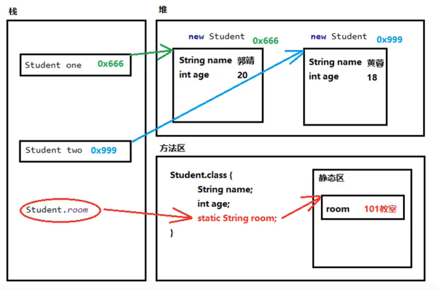

# Day03-Java

## 数组

数组用于存储**多个相同类型**的数据

```java
int[] arr;//定义了一个int类型的数组，数组名是arr（推荐）
int arr[];//定义了一个int类型的变量，变量名是arr数组
```

### 数组初始化

初始化分为动态和静态

动态：只指定数组长度，由系统分配数组内的值

静态：初始化时指定每个数组元素的值，由系统决定数组长度

```java
int[] arr = new int[3];//动态
int[] arr2 = {1,2,3};//静态
```

### 数组常见问题

索引越界、空指针异常

## 方法

方法（method）是将具有独立功能的**代码块**组织成为一个整体，使其具有特殊功能的代码集

创建方法的过程成为**方法定义**，使用方法的过程叫做**方法调用**

### 定义

方法定义和调用的格式如下

```java
public static void isThisMethod(type var1,type var2){
    //body
}
isThisMethod(var1,var2);
```

方法必须**先定义后调用**

### 形参和实参

形参：方法定义中的参数，等同于变量定义格式

实参：方法调用中的参数，等同于使用变量或常量

### 方法重载

方法重载指多个方法在**同一个类中**，都具有**相同的方法名**，且不同方法的**参数不同（类型不同或数量不同）**

```java
public static void getMax(int a,int b){
    //body
}
public static void getMax(double a,double b){
    //body
}
//以上为方法重载
```

### 参数传递

对于基本数据类型的参数，**形参的改变不影响实参的值**

对于引用类型的参数，**形参的改变会影响实参的值**

## 类和对象

类是对象的抽象，对象是类的实体

### 定义

类是java程序的基本组成单位

类的组成：属性和行为

* 属性：在类中通过**成员变量**来实现
* 行为：在类中通过**成员方法**来体现

### 类的内存图

在创建类对象时，内存中有三个区域：**栈（stack），堆（Heap），方法区（Method Area）**

当创建一个类及其对象时：

* 方法区中保存**class数据**，所有创建的类都存储在方法区中
* 堆中new了一块区域，用于保存创建的类对象的成员变量，其中**每个成员变量拥有独立的地址**，**成员方法存储的是方法区的成员方法地址**
* 栈中存储的是创建的类对象的地址，地址指向堆中成员变量的区域


## Static

### 作用于成员变量时

当一个成员变量使用了Static的时候，则这个成员变量不再属于对象实例，而属于所在的类，即多对象共享同一属性

```java
public class Student{

    public int id;
    private static int idCounter=0;
    public String name;
    public int age;
    private static String room="软件181";

    public Student(String name,int age){
        this.name=name;
        this.age=age;
        this.id=++idCounter;
    }
}

public static void main(String[] args){
    Student one=new Student("火老王",18);
    Student two=new Student("水老王",19);
    System.out.println(one.name+" "+one.age+" "+one.class+" "+one.id);//火老王 18 软件181 1
    System.out.println(two.name+" "+two.age+" "+two.class+" "+twp.id);//水老王 19 软件181 2
}
```

### 作用于成员方法时

一旦使用static修饰成员方法，则该方法变为静态方法，不属于实例对象而属于类，可以不创建实例对象直接调用

```java
public class Student{

    public Student(){

    }

    public static void StaticMethod(){
        System.out.print("这是一个静态方法");
    }
}

public static void main(String[] args){
    Student one = new Student();
    one.StaticMethod();//这是一个静态方法    通过变量名调用，不推荐
    Student.StaticMethod();//这是一个静态方法    通过类名调用。推荐
}
```

静态方法推荐通过**类名.静态方法\(\)**的方式调用，可以直观的看出这是一个静态方法

**静态方法不能访问非静态变量**，但是可以访问静态变量→在内存中先有【静态变量】，才有【非静态变量】

### Static内存图



当访问one和two的成员变量时，会在堆中查找对应的地址取值

但是当访问one和two的静态变量时，会**直接访问方法区中静态区的静态变量，跟对象实例没有任何关系**

### 静态代码块

当该类**第一次**被使用时，**静态代码块执行唯一一次**，且静态内容永远优先于非静态内容

```java
public class Student{

    static{
        System.out.print("执行静态代码块内容");
    }
    public Student(){
        System.out.print("执行构造方法");
    }
}

public static void main(String[] args){
    Student one = new Student();//执行静态代码块内容    执行构造方法
}
```

静态代码块通常用于**一次性地对静态成员变量进行赋值**

### 标准类制作

创建一个类要有一定的创建规则，通常按照以下规则创建：

* 成员变量：使用**private**修饰
* 构造方法：提供一个**无参**的构造方法，同时再提供一个**多参**的构造方法
* 成员方法：
  * 提供每一个成员变量固定的**get**_**\_**_**\(\)**和**set**_**\_**_**\(\)**方法，用于修改成员变量的值
  * 提供一个显示对象信息的**show\(\)**
* 创建对象并为其成员变量提供两种修改方式：**set**_**\_**_**\(\)**方法赋值以及**构造方法赋值**

## API

### StringBuilder

StringBuilder是一个可变的字符串类，其对象中的内容是可变的

与String的区别：String的内容不可变，StringBuilder可变

#### 常用方法

构造方法：同String，可以直接new StringBuilder\(\)创建，也可以new StringBuilder\(String str\)创建

添加数据：StringBuilder append\(\)，添加数据，并返回**对象本身**

反转数据：StringBuilder reverse\(\)，返回相反的字符序列

#### String和StringBuilder转换

**public String toString\(\)**可以将StringBuilder转化为String

**public StringBuilder\(String s\)**可以将String转化为StringBuilder

## 继承

父类（又称为基类或超类）所具有的成员变量和成员方法，子类可以通过继承的方式继承

```java
public class Fu{
    private String name;
    private int age;
    public void show(){
        System.out.print("Fu类show被调用");
    }
}
public class Zi extends Fu{
    public void method(){
        System.out.print("Zi类method被调用");
    }
}
```

Java中只支持单继承，**不支持多继承**，同时支持**多层继承**

### 继承的好处和弊端

好处：

* 提高了代码的**复用性**，多个类相同的成员可以放到同一个类中
* 提高了代码的**维护性**，如果需要修改后续类的内容，只需要修改父类即可

弊端：

* 继承增加了类之间的**耦合性**，父类修改时子类也会变化，削弱了子类的独立性

### Super

Super可以在子类访问父类的相关内容

### 重写方法

子类在重写父类的方法时可以用同样的方法名进行重写

在重写时可以通过**@Override**注解来帮助检查重写是否出错

### 重写的注意事项

父类中的**私有方法**不能够被子类重写

子类重写方法时，**访问权限不能比父类低**（public&gt;默认&gt;private）

